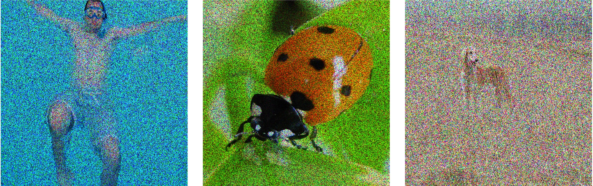

# Neighbor2Neighbor Denoised Images Demo

Gaussian Noise σ = 50

<figure>

</figure>

Gaussian Noise σ = 50 Denoised

<figure>

</figure>

Gaussian Noise σ = 100
<figure>

</figure>

Gaussian Noise σ = 100 Denoised
<figure>

</figure>

Gaussian Noise σ = 255

<figure>

</figure>

Gaussian Noise σ = 255 Denoised
<figure>

</figure>

Shot Noise λ = 10
<figure>

</figure>

Shot Noise λ = 10 Denoised
<figure>

</figure>

Shot Noise λ = 3
<figure>

</figure>
Shot Noise λ = 3 Denoised
<figure>

</figure>

Shot Noise λ = 1
<figure>

</figure>

Shot Noise λ = 1 Denoised
<figure>

</figure>
Speckle Noise σ = 102
<figure>

</figure>

Speckle Noise σ = 102 Denoised
<figure>

</figure>

Speckle Noise σ = 178.5

<figure>

</figure>

Speckle Noise σ = 178.5 Denoised
<figure>

</figure>

Speckle Noise σ = 255

<figure>

</figure>

Speckle Noise σ = 255 Denoised

<figure>

</figure>